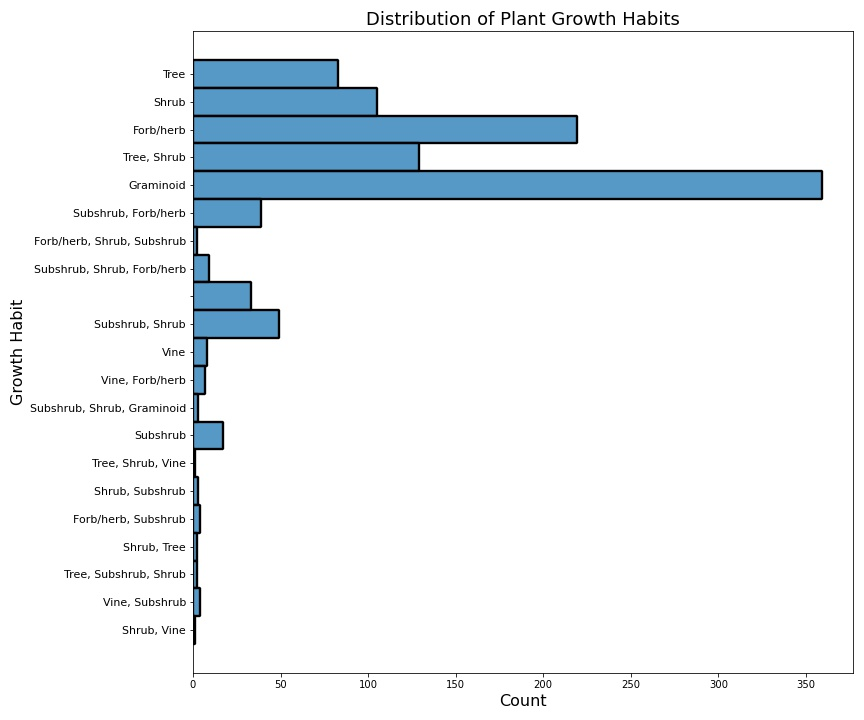

# Plant Recommender Project

---
## Contents
- [Background](#Background)
- [Problem Statement](#Problem-Statement)
- [Repository Directory](#Repository-Directory)
- [Data Dictionary and Data Sources](#Description-of-Data)
- [Modeling](#Modeling)
- [Results and Conclusions](#Findings-and-Recommendations)
- [Addtional Sources](#Additional-Citations)

---
## Background 
Recently (particularly after 2020), gardening and horticulture have exploded in popularity. This can be seen in news articles such this [article from Agweek](https://www.agweek.com/lifestyle/home-and-garden/6813622-The-pandemic-propelled-gardening-to-new-heights.-Will-the-trend-last) talking about record sales of seeds in 2020 and other trends. This indicates that there are many more beginner gardeners on the internet than ever before.

There also happens to be a lot of horticultural information available online. Simply look up a common species of houseplant and your search results will be populated with page after page of care guides and nurseries that offer said plant. However, it can be difficult to even know what plants to look up in the first place - rightfully so, because the question of "what plant should I grow" is harder to answer than it first seems.

This is why I decided to start this project - I hope I'll be able to make answering this question a bit easier.


## Problem Statement
---
The objective of this project was to create a recommender system that can take in user inputs about growing conditions and output recommended plant species using a spectral clustering method.

## Repository Directory
---
Here's a list of all the objects contained in this repository and links to each object:
- [Capstone Presentation](./capstone-presentation.pdf) -  A presentation I gave for this project.
- [Assets Folder](./assets) - Contains all of the visualizations I created for this project.
- [Datasets Folder](./datasets) - Contains all of the data I needed to create the models.
- [Imports, Cleaning and EDA Notebook](./code/01-data-cleaning.ipynb) - This notebook details the SQL query for the data used, the cleaning steps I took, and the code for some of the visualizations I created.
- [Data Cleaning Script](./code/cleaner.py) - A standalone version of the cleaning notebook above.
- [Streamlit Application Script](./code/plant_recommender.py) - The script used to run a local version of the plant recommender app via Streamlit.
- [Modeling Notebook](./code/02-modeling.ipynb) - This notebook details my search for the best clustering model to use and a test case of the suggestion engine built as a function, as well as some brief conclusions.

## Description of Data
---
Data was gathered from the [USDA PLANTS Database](), which contains information about tens of thousands of plant species found across North America and other US territories. Unfortunately, the API used to acess this dataset was offline at the time of building this model, so I instead sourced my data from a dump of the database on [sckott's usdaplants API](https://github.com/sckott/usdaplantsapi).

Once the data was pulled into a pandas dataframe, I was able to filter out null values (represented as empty strings) and one-hot encode the many categorical features present in this dataset. After doing this, I was left with the following dataset:
|Dataset|Size|Dimensions|Source|
|---|---|---|---|
|`cleaned-data.csv`|650 KB|1078 rows x 279 columns|[PLANTS Database](https://plants.usda.gov/home)|

This dataset had the following features:
|Feature|Type|Description|
|---|---|---|
|**id**|*int*|Identification number used in the PLANTS database|
|**Scientific_Name_x**|*object*|The scientific name for a plant|
|**Category**|*object*|A broad classification for the plant (i.e. angiosperm, gymnosperm)|
|**Family**|*object*|The taxonomical family of a plant|
|**Growth_Habit**|*object*|A decription of how a plant grows|
|**Native_Status**|*object*|A description of the regions where a plant is found and whether or not said plant is native to the region|
|**Active_Growth_Period**|*object*|A description of the time of year a plant is actively growing|
|**Fall_Conspicuous**|*object*|Whether or not a plant has showy fall foliage|
|**Fire_Resistance**|*object*|Whether or not a plant is resistant to wildfires|
|**Flower_Color**|*object*|The primary color of a plant's flowers|
|**Flower_Conspicuous**|*object*|Whether or not a plant has noticeable flowers|
|**Fruit_Conspicuous**|*object*|Whether or not a plant has ornamental or edible fruit|
|**Growth_Rate**|*object*|A plant's growth speed|
|**Lifespan**|*object*|A plant's average lifespan|
|**Toxicity**|*object*|The toxicity of a plant to humans|
|**Drought_Tolerance**|*object*|The drought tolerance of a plant|
|**Hedge_Tolerance**|*object*|A plant's tolerance of being pruned into a hedge|
|**Moisture_Use**|*object*|The water use for a given plant|
|**pH_Minimum**|*float*|The minimum soil pH a plant will tolerate|
|**pH_Maximum**|*float*|The maximum soil pH a plant will tolerate|
|**Salinity_Tolerance**|*object*|A plant's tolerance of salty conditions|
|**Shade_Tolerance**|*object*|A plant's tolerance of shady conditions|
|**Temperature_Minimum_F**|*float*|The minimum temperature (F) a plant can survive|
|**Bloom_Period**|*object*|The time of year a plant blooms|

After cleaning the data, I also performed some EDA to get a better sense of what the data looked like. 



The two charts above show that there is a decent amount of variety in the dataset, although there are a lot of graminoid grass species present.


## Modeling
---
The overall modeling process for this project is as follows:

### Clustering
To actually produce suggestions, there needs to be a way to sort the data, which is where clustering models come in handy. I started with a `DBSCAN` model to find the number of clusters that worked best for the dataset (which turned out to be 68) and tried out `KMeans` and `SpectralClustering` models as well to find the model with the best Silhouette score.


|Model|Number of Clusters|Silhouette Score|
|---|---|---|
|**DBSCAN**|68|0.14|
|**KMeans**|70|0.05|
|**Spectral Clustering**|5|0.51|

Details regarding the other iterations of each clustering model can be found in [this](./code/02-modeling.ipynb) notebook. The order of the models above was the same order that I created each model in.

The best clustering model by far turned out to be the `SpectralClustering` model, after it was tuned (as you can see above). The specific hyperparameters for this model were:
|Gamma|Number of Clusters|n_init|
|---|---|---|
|0.5|5|5|

## Creating the Recommender System

After creating the `SpectralClustering` model, the actual recommender system could be created. The system I created is an **item-based recommender**, which uses the similarity between items (in this case, plants) to make recommendations. I created this model twice: once in the form of a function in [this](./code/02-modeling.ipynb) notebook and a more refined version in a Streamlit app. The pure Python function was mainly intended as a very bare-bones test case, and the Streamlit app was meant to be a final user-facing form to interact with the model.

The Streamlit app I created is in this repository [here](./code/plant_recommender.py). To run this make sure the Streamlit library is installed on your local machine:
```
pip install streamlit
```
And then run the code from your local copy of the repository as follows:
```
streamlit run plant-recommender.py
```

## Findings and Recommendations
---
Overall, I would consider this project a moderate success. The Streamlit app works as intended and makes decent predictions. However, I do notice three issues with the app:
1. The app runs slowly - unfortunately, the entire dataset has to be re-clustered each time a query is made so each query can take a few minutes to output suggestions.
2. The clusters made via Spectral Clustering are large - this can lead to situations where the clusters are too large to allow the model to make precise suggestions. I noticed some results had plant species that didn't make a lot of sense given the query.
3. There are a lot of grasses in this dataset. This can be seen in the plant order histogram above (lots of *Cyperales*). This means that with any given query, there is a good chance a grass will be included, which isn't helpful for most beginner gardeners, but could prove useful for things like habitat restoration.

With these results in mind, I have a few ideas for improvements and places to go with this project for the future:
- Add links to online resources and images of each plant suggested to make the app more user friendly.
- Obtain more data on more commercially-available species and cultivars. This dataset was full of native species, some of which are not grown by any nursery.
- Add more features from the PLANTS database to see if this improves the performance of the model
- Add a way for users to specify the region they reside in. This would allow users to filter through results and select only native species (or filter out invasive species)


## Additional Citations
---
- [Documentation for the SQLite library used for SQL queries](https://docs.python.org/3/library/sqlite3.html )
- [PLANTS Database](https://plants.usda.gov/home)
- [More information on accessing SQLite databases](https://datacarpentry.org/python-ecology-lesson/09-working-with-sql/index.html )
- [An article on different types of clustering models I found useful](https://machinelearningmastery.com/clustering-algorithms-with-python/ )
- [An article discussing how to make recommender systems using clustering models](https://towardsdatascience.com/build-your-own-clustering-based-recommendation-engine-in-15-minutes-bdddd591d394)
- [The site I used to make the modeling flowchart seen above](https://app.diagrams.net/ )
- [An article discussing Spectral Clustering](https://towardsdatascience.com/spectral-clustering-for-beginners-d08b7d25b4d8 )
- [sckott's USDA PLANTS API, from which I sourced my data](https://github.com/sckott/usdaplantsapi)


